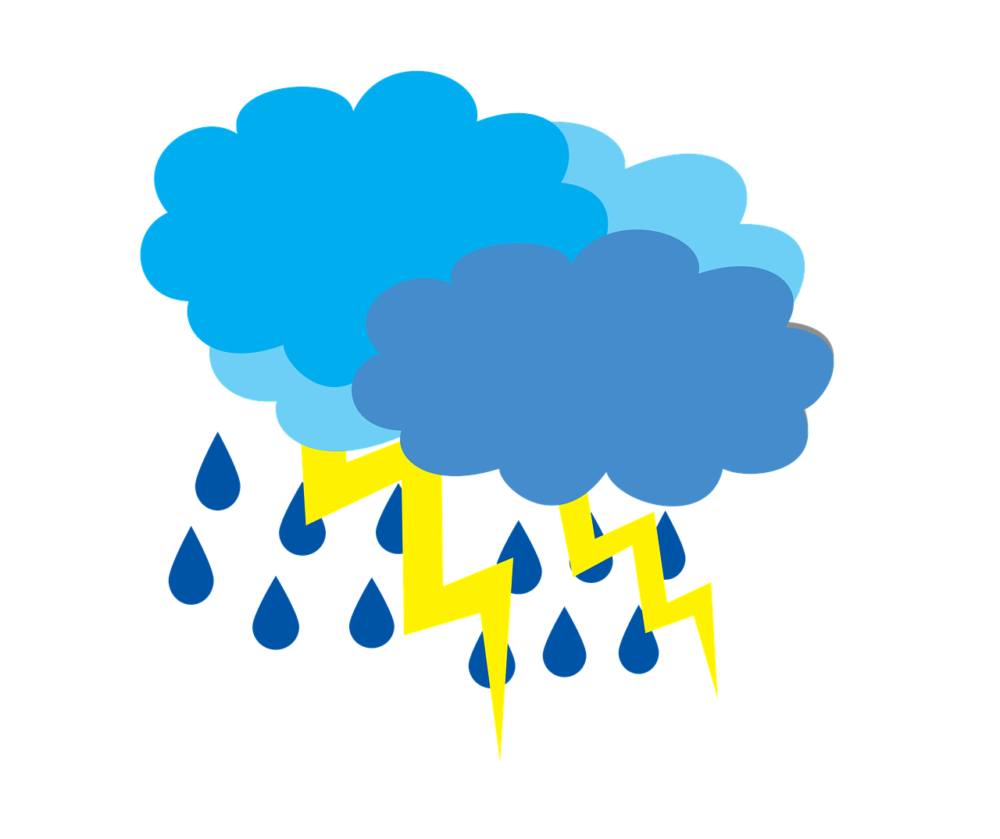
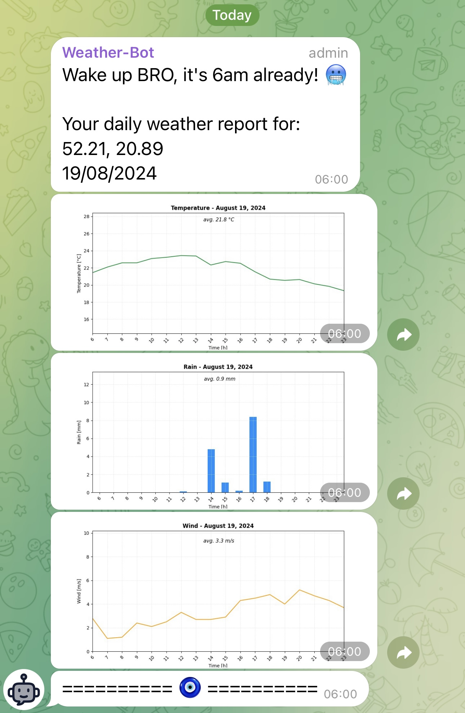

<h1 align="center">Weather Bot</h1>

  <b>An automated weather bot that will notify you daily of weather conditions via a message on Telegram</b>
  

## Description

This repository contains the source code for the Weather Bot that continuously (every 24h) provides information about the weather conditions for the current day. The metrics reported by the bot include: **temperature**, **rain**, and **wind** conditions. The bot sends a message every day at 6am (GMT+2 time) via Telegram, so that you can better plan your day as soon as you wake up.

_Personally, I use it to plan my day in terms of choosing the optimal time for running._ :running_man: :yum:

## Sample result

Below is a sample message sent by the bot on Telegram:

  

## Additional configuration required

- **_Your location_** by geographic coordinated in txt file ([geo-data.txt](files/geo-data.txt))
- Telegram for **_bot API token_** and **_group chat ID_**
- **_AWS cloud environment_** for running code in specific schedule ([AWS Lambda](https://aws.amazon.com/lambda/) & [Amazon EventBridge](https://aws.amazon.com/eventbridge/))

## Main resources used

- [Open-Meteo](https://open-meteo.com) - open-source API for weather forecasts
- [pandas](https://pandas.pydata.org) - data analysis tool
- [Matplotlib](https://matplotlib.org) - data visualization tool
- [Telegram Bot API](https://core.telegram.org/bots/api) - API for Telegram Bot
- [python-telegram-bot](https://python-telegram-bot.org) - asynchronous interface for Telegram Bot API
- [AWS Lambda](https://aws.amazon.com/lambda/) & [Amazon EventBridge](https://aws.amazon.com/eventbridge/) - cloud computing services to run code in specific schedule
